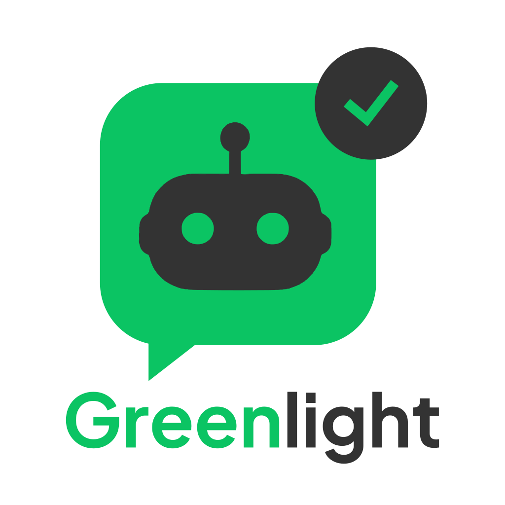

<p align="center">
  
</p>

# Greenlight

Self-hosted HTTP gateway that gives AI agents a human-in-the-loop line to **Telegram**, **Slack**, **Microsoft Teams**, **Discord**, **Google Chat**, **WhatsApp**, and **Messenger** — interactive prompts, per-agent channels, and signed callbacks.

Built with [Chat SDK](https://chat-sdk.dev/). Platform credentials are registered per channel via API (not global env vars).

**Documentation:** run `npm run dev:docs` (http://localhost:3001) or see [`docs-site/`](docs-site/).

## Quick start (local dev)

```bash
cp .env.example .env
# Edit .env — set DATABASE_URL, CALLBACK_SIGNING_SECRET, WEBHOOK_SECRET

docker compose -f docker-compose.dev.yml up -d --build
curl http://localhost:8100/healthz
```

Register a channel, then send a prompt:

```bash
curl -X POST http://localhost:8100/register-channel \
  -H 'Content-Type: application/json' \
  -d '{
    "channel_id": "my-telegram-prompts",
    "platform": "telegram",
    "target_chat_id": "-1001234567890",
    "credentials": { "bot_token": "123456789:YOUR_TOKEN" },
    "channel_type": "PROMPT"
  }'

curl -X POST http://localhost:8100/v1/prompts \
  -H 'Content-Type: application/json' \
  -d '{
    "channel_id": "my-telegram-prompts",
    "text": "Ready to deploy v2.4.1?",
    "options": ["Deploy", "Cancel"],
    "callback_url": "https://your-agent.example.com/on_answer"
  }'
```

Full guides: [Quickstart](docs-site/content/getting-started/quickstart.mdx), [Platforms](docs-site/content/platforms/), [API Reference](docs-site/content/api-reference/), [Configuration](docs-site/content/self-hosting/configuration.mdx).

## Supported platforms

| Platform | Delivery | Credentials |
|----------|----------|-------------|
| `telegram` | Polling (default) or webhook | `bot_token` |
| `slack` | Webhook | `bot_token`, `signing_secret` |
| `teams` | Webhook | `app_id`, `app_password` (+ optional `app_tenant_id`) |
| `discord` | Webhook + Gateway | `bot_token`, `public_key`, `application_id` |
| `gchat` | Webhook | `service_account_json`, `google_chat_project_number` |
| `whatsapp` | Webhook (GET+POST) | `access_token`, `app_secret`, `phone_number_id`, `verify_token` |
| `messenger` | Webhook (GET+POST) | `page_access_token`, `app_secret`, `verify_token` |

**Prompt limits:** WhatsApp and Messenger support at most **3** button options per prompt.

## Admin UI

Compose includes the optional **greenlight-ui** admin app at `http://localhost:3000`.

1. Start the stack: `docker compose -f docker-compose.dev.yml up -d --build`
2. Open `http://localhost:3000/setup` to create the super admin
3. Sign in at `/login` — manage channels, prompts, and dashboard stats

Hands-on Telegram walkthrough (internal runbook): [docs/USER_SETUP.md](docs/USER_SETUP.md). Canonical product docs live in `docs-site/`.

## Repository layout

```
core/       — Hono API gateway (port 8100)
ui/         — Next.js admin app (port 3000)
docs-site/  — Product documentation (Nextra, port 3001)
```

## Docker / Dokploy

```bash
cp .env.example .env
docker compose -f docker-compose.dev.yml up -d --build   # dev
# Production: docker-compose.yml + .env.production.example — see docs-site Self-Hosting
```

Local without the app containers:

```bash
npm install
docker compose -f docker-compose.dev.yml up -d postgres
npm run dev:core    # API on :8100
npm run dev:ui      # Admin UI on :3000
npm run dev:docs    # Docs on :3001
```

## Contributing

See [CONTRIBUTING.md](CONTRIBUTING.md) and [CODE_OF_CONDUCT.md](CODE_OF_CONDUCT.md).

## License

Greenlight is **source-available** under the [Business Source License 1.1](LICENSE)
(BUSL-1.1) — **not** an OSI-approved open source license.

| | Community (`core/`, `ui/`, `docs-site/`) | Enterprise |
|--|---------------------------|------------|
| Location | This repository | Commercial license from the Licensor (not in this repo) |
| License | BUSL-1.1 | Proprietary |
| Self-host | Yes | Paid license only (when available) |
| Sell as competing hosted subscription | **No** | **No** |

Details: [docs/LICENSING.md](docs/LICENSING.md) and [docs-site Legal](docs-site/content/legal/licensing.mdx).
