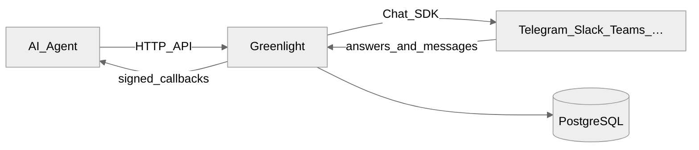

# Concepts

Greenlight sits between your AI agent and chat platforms.

## Channel types

| Type | Direction | `callback_url` | Typical use |
|------|-----------|----------------|-------------|
| **PROMPT** | Outbound questions to humans | Optional on the prompt | Deploy gates, approvals, escalations |
| **MESSAGE** | Inbound chat → agent | **Required** on the channel | Ongoing agent conversations |

Register channels with `POST /register-channel`. Credentials are stored per
channel — one Greenlight instance can talk to many bots and workspaces.

## Auth layers

Greenlight has three independent auth surfaces:

| Layer | Header / mechanism | Who uses it |
|-------|--------------------|-------------|
| Agent API | `X-API-Key` (when `USE_AUTH=true`) | Your agents and scripts |
| Admin API | `X-Admin-Token` | Admin UI BFF / operators |
| Admin UI | NextAuth session (`AUTH_SECRET`) | Humans in the browser |

Never give `ADMIN_INTERNAL_TOKEN` to agents. Mount the Admin API only when that
token is set; otherwise `/admin/v1/*` returns 404.

## Prompts

A prompt is an interactive question with optional button options:

- Up to **10** options (WhatsApp / Messenger capped at **3**)
- Optional free-text replies (`allow_text`)
- Optional TTL (`ttl_sec`, default 3600)
- Optional media (`media_url`, `media_path`, or multipart upload)
- Optional `correlation_id` echoed in the answer callback

Prompt IDs look like `#123`. In URLs, encode as `%23123`.

## Callbacks

- **Prompt answers** — signed with HMAC-SHA256 (`X-Signature: sha256=…`)
- **Channel messages** — unsigned JSON `message.created` events

See [Callbacks](/guides/callbacks) for payload shapes and verification.

## Chat SDK

Greenlight uses [Chat SDK](https://chat-sdk.dev/) adapters under the hood.
You do not import platform SDKs yourself for basic flows — register credentials
via the API and Greenlight starts/stops bots per channel.
