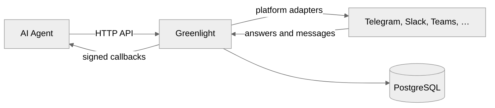
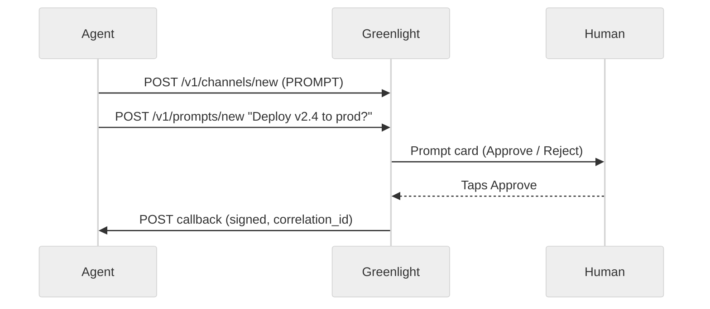
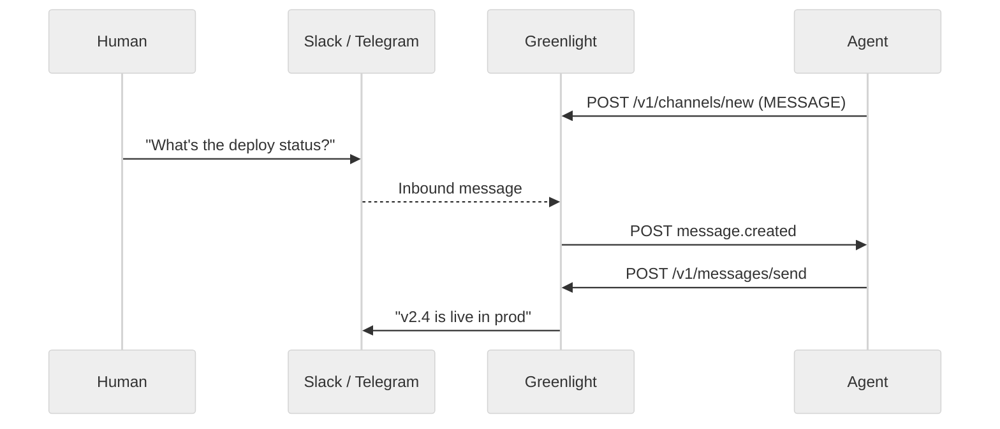

# Concepts

Greenlight sits between your AI agent and chat platforms.

## Channel types

| Type        | Direction                    | `callback_url`              | Typical use                          |
| ----------- | ---------------------------- | --------------------------- | ------------------------------------ |
| **PROMPT**  | Outbound questions to humans | Optional on the prompt      | Deploy gates, approvals, escalations |
| **MESSAGE** | Inbound chat → agent         | **Required** on the channel | Ongoing agent conversations          |

### PROMPT — approval gate

Your agent asks a human to decide; Greenlight delivers a prompt card and
returns the answer via a signed callback.

### MESSAGE — agent conversation

Humans message the bot in chat; Greenlight forwards each message to your agent,
which can reply with `POST /v1/messages/send`.

The “agent” in these flows can be custom code or an [automation platform](/guides/automation-platforms) (n8n, Zapier, Make, etc.).

Create channels with `POST /v1/channels/new`. Credentials are stored per
channel — one Greenlight instance can talk to many bots and workspaces.

## API path verbs

| Verb | Use for | Examples |
| ---- | ------- | -------- |
| **`new`** | Create a durable resource | `POST /v1/channels/new`, `POST /v1/prompts/new` |
| **`send`** | Deliver chat text on a MESSAGE channel | `POST /v1/messages/send` |

Prompts and channels are created once and tracked in the database. MESSAGE
outbound is ongoing chat delivery — not a new resource type.

### Multiple workflows on one channel

Greenlight does not register workflows or agents as first-class entities. Any
HTTP client with a valid `X-API-Key` can use a `channel_id`.

| Channel type | Multiple workflows posting outbound?                                     | Multiple inbound subscribers?                         |
| ------------ | ------------------------------------------------------------------------ | ----------------------------------------------------- |
| **PROMPT**   | **Yes** — share one `channel_id`; each prompt has its own `callback_url` | N/A — inbound is prompt answers only                  |
| **MESSAGE**  | Outbound via `POST /v1/messages/send` from any client | **No** — one channel `callback_url` receives all chat |

Use a shared PROMPT channel when many CI jobs or automations need the same ops
chat for approvals. Use MESSAGE when humans converse with a single agent
webhook. More detail: [Features & benefits](/getting-started/features).

## Auth layers

Greenlight has three independent auth surfaces:

| Layer     | Header / mechanism                 | Who uses it              |
| --------- | ---------------------------------- | ------------------------ |
| Agent API | `X-API-Key` (when `USE_AUTH=true`) | Your agents and scripts  |
| Admin API | `X-Admin-Token`                    | Admin UI BFF / operators |
| Admin UI  | NextAuth session (`AUTH_SECRET`)   | Humans in the browser    |

Never give `ADMIN_INTERNAL_TOKEN` to agents. Mount the Admin API only when that
token is set; otherwise `/admin/v1/*` returns 404.

## Prompts

A prompt is an interactive question with optional button options:

- Up to **10** options (WhatsApp / Messenger capped at **3**)
- Optional free-text replies (`allow_text`)
- Optional TTL (`ttl_sec`, default 3600)
- Optional media (`media_url`, `media_path`, or multipart upload)
- Optional `correlation_id` echoed in the answer callback

Prompt IDs look like `#123`. In URLs, encode as `%23123`.

## Callbacks

- **Prompt answers** — signed with HMAC-SHA256 (`X-Signature: sha256=…`)
- **Channel messages** — unsigned JSON `message.created` events

See [Callbacks](/guides/callbacks) for payload shapes and verification.

## Platform adapters

You do not import platform SDKs yourself for basic flows — register credentials
via the API and Greenlight starts/stops bots per channel.
