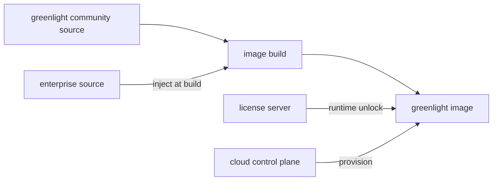

# Editions & admin identity

Greenlight ships in three editions. **Community** (this repository) is what you
self-host today. **Enterprise** and **Cloud** are proprietary and add
organization-aware identity, RBAC, and audit. The HTTP API shape is the same
across editions; who can sign in and what they can see differs.

## At a glance

| Edition | Who runs it | Organizations | Human admins | API keys (today / target) |
| ------- | ----------- | ------------- | ------------ | ------------------------- |
| **Community self-host** | You | One implicit instance (no org UI) | One super admin via `/setup` | Instance-wide scoped keys |
| **Enterprise self-host** | Your company | One logical org (not shown in UI) | Multiple users; some can be promoted to admin | Org-scoped keys + richer audit |
| **Cloud** | Licensor (hosted) | Many orgs; users join several | Per-org roles: admin, member, … | Org-scoped keys; no cross-org access |

See [Licensing](/legal/licensing) for what is in the community repo vs
commercial editions.

## Community self-host (this repo)

Every instance is independent:

1. First visit to **/setup** creates the **super admin** (`admin_users` table).
2. That human signs in with NextAuth (`AUTH_SECRET`).
3. The UI calls core with `GREENLIGHT_API_KEY` — a database key with `admin`
   scopes (bootstrapped from `API_KEY` on first boot, or created in Settings).
4. Agents and automation use their own scoped `X-API-Key` values.

There is **no organization picker** and **no multi-user admin** in community
today. The whole Postgres database is one tenant. Operators who need a second
human account reset `admin_users` or use shared credentials (not recommended).

## Enterprise self-host

Same deployment model as community (your infrastructure, one Greenlight stack),
but with commercial add-ons:

- **One organization** exists logically; it is not exposed as a separate entity
  in the UI (no org switcher).
- **Multiple human users** can sign in — not only the first `/setup` account.
- **Role elevation**: ordinary users can be granted admin by an existing admin
  (exact UX is edition-specific).
- **SSO, audit exports, advanced RBAC** and similar features live in enterprise
  code, not in this repository.

API keys and channel data still belong to that single company instance; keys
should be attributable to teams or integrations, not shared as one global admin
secret.

## Cloud (hosted)

Multi-tenant SaaS operated by the Licensor:

- A **user** (identity) can belong to **multiple organizations**.
- In org **A** they may be **admin**; in org **B** only **member** (or no
  access).
- All API and UI operations are **scoped to the active organization** — no
  cross-org reads or writes.
- Billing, provisioning, and control-plane code are outside the community repo
  (`greenlight-platform/cloud`).

Org admins manage members, keys, and settings for their org only. Platform
operators have separate internal tooling (not customer-facing).

## How this relates to API keys (community today)

Community edition implements [scoped API keys](/api-reference/agent-api) at
**instance** scope:

- Keys are rows in `api_keys` with scope arrays (`admin`, `agent`, `readonly`, …).
- Outbound messages record `api_key_id` when stored.
- `API_KEY` in env bootstraps the first admin key only when the table is empty.

That matches a single-tenant self-host. Enterprise and Cloud extend the same
ideas with **organization_id** on keys and resources, **human actor** on UI
actions, and a dedicated **audit log** — see [Security](/guides/security#edition-roadmap).

## Edition roadmap (identity & audit)

| Capability | Community | Enterprise | Cloud |
| ---------- | --------- | ---------- | ----- |
| `/setup` super admin | Yes | First user + invite flow | Sign-up + org create / invite |
| Multiple human users | No | Yes | Yes |
| Org switcher | No | No (single invisible org) | Yes |
| Scoped API keys | Yes (instance) | Yes (org) | Yes (org) |
| `api_key_id` on outbound messages | Yes | Yes | Yes |
| Full audit trail (who changed what) | Partial | Yes | Yes |
| SSO | No | Planned / edition | Yes |

For commercial editions, contact the Licensor — see [Licensing](/legal/licensing).

## Repository boundaries

Code is split on purpose. Do not expect enterprise or cloud implementation in
this public repository.

| Where | What lives there |
| ----- | ---------------- |
| **`greenlight`** (this repo) | Community `core`, `ui`, `docs-site`. BUSL-1.1. Single-tenant self-host. |
| **`greenlight-platform/enterprise`** (private) | Enterprise **source only** (SSO, audit, RBAC, …). Injected into the **same** `greenlight` image at build — **not** a separate published enterprise image. Unlocked at runtime with a valid license. |
| **`greenlight-platform/cloud`** (private) | Hosted **control plane** only: billing, subscriptions, organisations, provisioning — not a fork of the gateway. |
| **License server** (private, planned) | Generates and verifies enterprise licenses. |

**Self-host:** pull the standard `greenlight` image, run on your infra, add a
license to enable enterprise features. There is no `greenlight-enterprise` image
to pull separately.

**Documentation:** product docs stay in this `docs-site`. Platform builders
maintain architecture notes in the private `greenlight-platform` monorepo
(`ARCHITECTURE.md`). Public docs describe editions and behavior, not proprietary
build pipelines.
