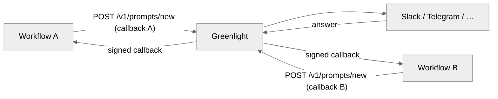
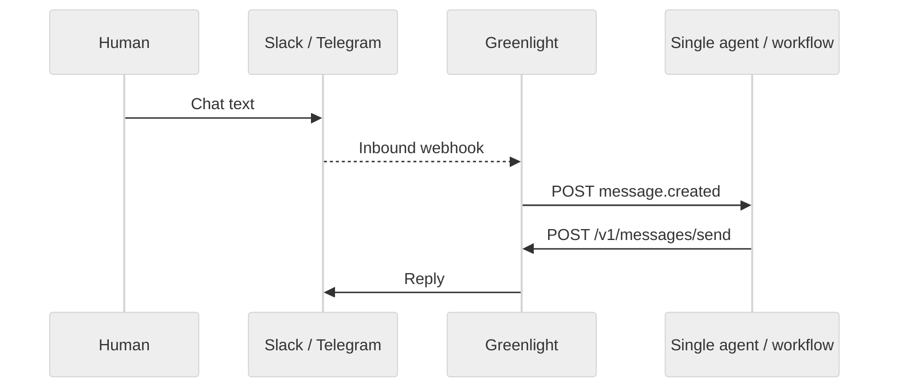

# Features & benefits

Greenlight is a self-hosted HTTP gateway between your AI agents or automation
workflows and chat platforms. Humans stay in Telegram, Slack, Teams, Discord,
Google Chat, WhatsApp, or Messenger — you do not ship platform SDKs for basic
approval and chat flows.

In this docs set, **workflow** and **agent** mean any HTTP client that calls the
Agent API (custom code, n8n, Zapier, Make, and so on). Greenlight does not
register agents as first-class entities; routing is defined by channels,
prompts, and callback URLs.

## Key features

- **Seven chat platforms** — Telegram, Slack, Microsoft Teams, Discord, Google
  Chat, WhatsApp, and Messenger. See [Platforms](/platforms).
- **PROMPT and MESSAGE channel modes** — outbound human-in-the-loop questions,
  or bidirectional chat with your agent. See [Concepts](/getting-started/concepts).
- **Per-channel credentials** — register bots and tokens via API per channel,
  not as global environment variables.
- **Interactive prompts** — button options, optional free-text replies, TTL,
  media, and `correlation_id` for matching answers. See [Prompts](/guides/prompts).
- **Signed prompt callbacks** — HMAC-SHA256 (`X-Signature`) on prompt answers.
  See [Callbacks](/guides/callbacks).
- **Bidirectional chat on MESSAGE channels** — inbound messages forward to your
  `callback_url`; replies go out with `POST /v1/messages/send`.
- **Admin UI** — manage channels, prompts, and messages; view dashboard stats;
  configure data retention; send messages on MESSAGE channels.
- **Automation-friendly HTTP API** — works with n8n, Zapier, Make, Pipedream,
  and similar tools with no Greenlight plugin. See
  [Automation platforms](/guides/automation-platforms).
- **Polling fallback** — `GET /v1/prompts/{id}` and pending-prompt listing when
  webhooks are inconvenient.

## Benefits

- Ship human-in-the-loop approvals without building and maintaining a bot per
  platform.
- Point many CI jobs or workflows at one ops approval channel (PROMPT mode) —
  each prompt's answer returns to the workflow that created it.
- Keep platform credentials and chat traffic on infrastructure you control.
- Use the same gateway for deploy gates and conversational agents.

## How workflows and channels work together

Create a channel once (`POST /v1/channels/new`), then pass that `channel_id`
from any workflow that should talk to that chat.

### Many workflows → one PROMPT channel

Any client with a valid `X-API-Key` can create prompts on the same `channel_id`.
Each prompt carries its own `callback_url`, so answers route back to the
workflow that asked the question:

Typical use: several pipelines share one `#ops-approvals` Slack channel; each
build gets its own prompt card and its own resume webhook.

### MESSAGE channels — one inbound destination

A MESSAGE channel has a **single** `callback_url`. Every inbound human message
from that chat goes to that URL. Multiple workflows cannot each subscribe to the
same MESSAGE channel; pick one consumer, or register separate channels for
separate chats.

Humans message your workflow or AI **in the chat app**, not through the Admin
UI. The Admin UI is for operators (channel/prompt management and MESSAGE test
sends).

## MESSAGE vs PROMPT — choose the right mode

| Goal                                         | Use         |
| -------------------------------------------- | ----------- |
| Deploy gates, approvals, escalations         | **PROMPT**  |
| Ongoing conversation with an agent or bot    | **MESSAGE** |
| Many workflows posting questions to one chat | **PROMPT**  |
| Humans freely messaging an agent in chat     | **MESSAGE** |

| Type        | Verb | Agent → human      | Human → agent                                   | Callback                                 |
| ----------- | ---- | ------------------ | ----------------------------------------------- | ---------------------------------------- |
| **PROMPT**  | `new` | `POST /v1/prompts/new` | Prompt answers only (buttons or `ID:#123` text) | Per-prompt `callback_url` (signed)       |
| **MESSAGE** | `send` | `POST /v1/messages/send` | Any chat text                                   | Single channel `callback_url` (unsigned) |

## Limitations

- **MESSAGE inbound is not multi-subscriber** — one `callback_url` per channel.
- **PROMPT is not a general chat router** — arbitrary text on a PROMPT channel is
  ignored unless it matches a pending prompt reply format.
- **No agent registry** — Greenlight does not store workflow or agent IDs; you
  manage ownership and routing in your own stack via `channel_id`,
  `correlation_id`, and callback URLs.
- **Shared Agent API key** — one `API_KEY` for the Agent API today (no per-agent
  keys).
- **One binding per chat recommended** — if two active channels share the same
  platform, target chat, and credentials, inbound routing is nondeterministic.
  Prefer a single `channel_id` per chat binding. See
  [Channels](/guides/channels#routing-rules).

## Next steps

| I want to…                         | Start here                                           |
| ---------------------------------- | ---------------------------------------------------- |
| Run Greenlight locally             | [Quickstart](/getting-started/quickstart)            |
| Understand auth and architecture   | [Concepts](/getting-started/concepts)                |
| Call the API from an agent         | [Agent integration](/guides/agent-integration)       |
| Wire n8n, Zapier, Make, or similar | [Automation platforms](/guides/automation-platforms) |
| Register and manage channels       | [Channels](/guides/channels)                         |
