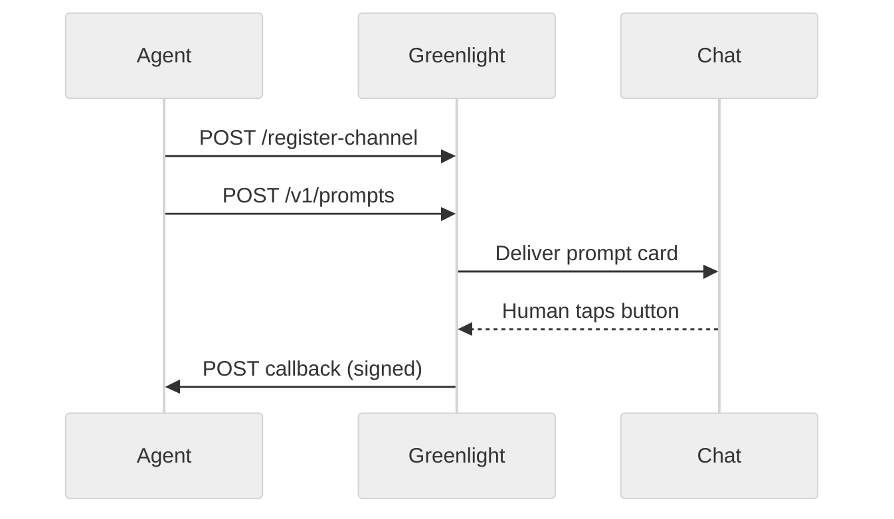

# Agent integration

Wire your AI agent to Greenlight over HTTP.

## Auth

When `USE_AUTH=true`, every agent route requires:

```http
X-API-Key: <API_KEY>
```

Protected paths include `/v1/*`, `/register-channel`, `/send`, and `/channels`.

## Typical flow



1. Register a `PROMPT` channel once
2. Create prompts with `callback_url` pointing at your agent
3. Verify `X-Signature` on inbound answer webhooks
4. Optionally poll `GET /v1/prompts/{id}` or `/v1/prompts/pending`

## Create a prompt

```bash
curl -X POST http://localhost:8100/v1/prompts \
  -H "X-API-Key: $API_KEY" \
  -H "Content-Type: application/json" \
  -d '{
    "channel_id": "my-telegram-prompts",
    "text": "Approve production deploy?",
    "options": ["Approve", "Reject"],
    "allow_text": false,
    "ttl_sec": 3600,
    "correlation_id": "deploy-42",
    "callback_url": "https://agent.example.com/on_answer"
  }'
```

Success:

```json
{
  "prompt_id": "#123",
  "channel_id": "my-telegram-prompts",
  "message_id": 456
}
```

## Verify prompt callbacks

Prompt answers are signed with HMAC-SHA256 of the raw body using
`CALLBACK_SIGNING_SECRET`:

```http
X-Signature: sha256=<hex>
```

Always compare signatures with a timing-safe function. Reject missing or invalid
signatures.

See [Callbacks](/guides/callbacks) for the full payload.

## MESSAGE channels

For inbound chat → agent:

1. Register `channel_type: "MESSAGE"` with a reachable `callback_url`
2. Handle unsigned `message.created` JSON events
3. Optionally reply with `POST /send`

For local agents, expose your callback with ngrok or Cloudflare Tunnel.

## Next

- [Prompts](/guides/prompts) — options, text replies, media
- [Channels](/guides/channels) — register schema
- [Agent API](/api-reference/agent-api) — endpoint table
