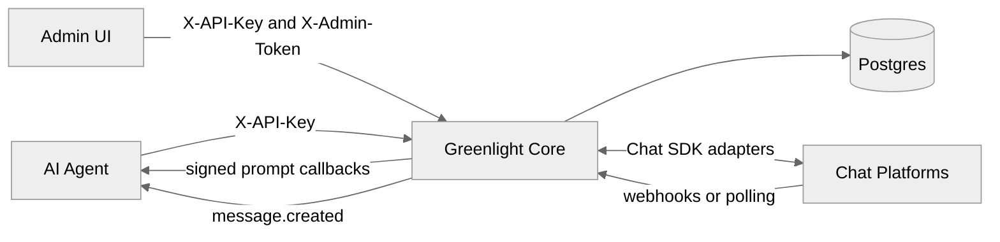

# Architecture

Greenlight is a small gateway: HTTP API + Chat SDK bots + Postgres.

## Components

| Piece         | Role                                                                   |
| ------------- | ---------------------------------------------------------------------- |
| **core**      | Hono server on `:8100` — agent API, admin API, webhooks, bot lifecycle |
| **ui**        | Next.js admin app on `:3000` — setup, channels, prompts, dashboard     |
| **docs-site** | Nextra docs on `:3001`                                                 |
| **Postgres**  | Channels, prompts, admin users                                         |

## Runtime behavior

- On boot, core applies `schema.sql` and restores active channel bots
- Prompt expiry runs on an interval
- Optional `CLEAN_ON_BOOT` clears stale prompt state
- Platform credentials live in the DB per channel — not in global env

## Trust boundaries

- Agents use `X-API-Key` only
- Operators use Admin UI sessions + `X-Admin-Token` server-side
- Chat platforms call `/webhooks/{platform}/{channelId}`
- Agents receive callbacks on URLs they registered (validated against SSRF rules)
