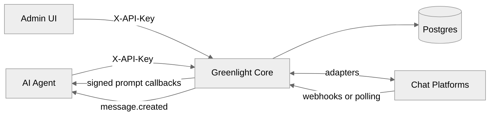

# Architecture

Greenlight is a small gateway: HTTP API + platform bots + Postgres.

## Components

| Piece         | Role                                                               |
| ------------- | ------------------------------------------------------------------ |
| **core**      | Hono server on `:8100` — `/v1` API, webhooks, bot lifecycle        |
| **ui**        | Next.js admin app on `:3001` — setup, channels, prompts, dashboard |
| **docs-site** | Nextra docs on `:3003`                                             |
| **Postgres**  | Channels, prompts, admin users                                     |

## Runtime behavior

- On boot, core applies `schema.sql` and restores active channel bots
- Prompt expiry runs on an interval
- Optional `CLEAN_ON_BOOT` clears stale prompt state
- Platform credentials live in the DB per channel — not in global env

## Trust boundaries

- Agents and the Admin UI use scoped `X-API-Key` headers
- Operators use Admin UI browser sessions (`AUTH_SECRET`)
- Chat platforms call `/webhooks/{organization_id}/{platform}/{channel_id}`
- Agents receive callbacks on URLs they registered (validated against SSRF rules)
