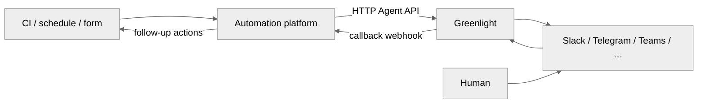
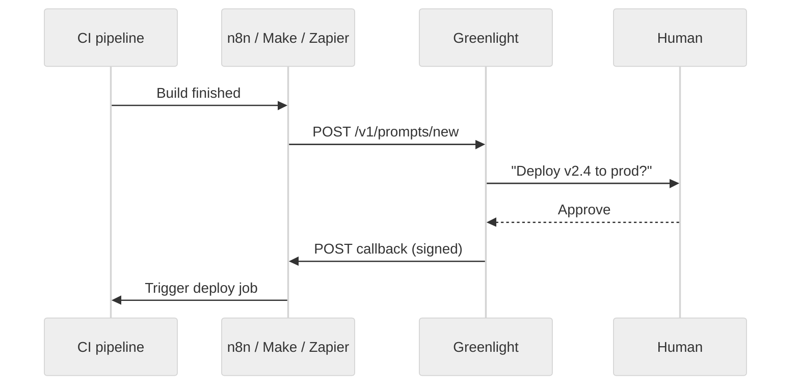

# Automation platforms

Greenlight is a plain HTTP API. Any workflow tool that can send REST requests and
receive webhooks can act as the “agent” — no custom Greenlight plugin required.

Use automation platforms when you want visual workflows, scheduled jobs, or
glue between Greenlight and the rest of your stack (CI, ticketing, databases,
LLM APIs) without writing a long-lived service.

## How it fits



**Outbound (automation → Greenlight)** — `POST /v1/channels/new` and
`POST /v1/prompts/new` create durable resources; `POST /v1/messages/send`
delivers chat text on MESSAGE channels. Authenticate with `X-API-Key` when
`USE_AUTH=true`.

**Inbound (Greenlight → automation)** — prompt answers hit the prompt's
`callback_url`; MESSAGE channels post `message.created` to the channel's
`callback_url`. See [Callbacks](/guides/callbacks) for payload shapes.

## Recommended platforms

| Platform                                                                           | Hosting              | Strengths with Greenlight                                                                                        |
| ---------------------------------------------------------------------------------- | -------------------- | ---------------------------------------------------------------------------------------------------------------- |
| [n8n](https://n8n.io/)                                                             | Self-hosted or cloud | Pairs well with self-hosted Greenlight; HTTP Request + Webhook nodes; Code node for HMAC on prompt callbacks     |
| [Activepieces](https://www.activepieces.com/)                                      | Self-hosted or cloud | Open-source workflow builder; HTTP and webhook pieces for the same request/response pattern                      |
| [Make](https://www.make.com/)                                                      | Cloud                | Visual scenarios; HTTP module + custom webhook module for multi-step approval flows                              |
| [Zapier](https://zapier.com/)                                                      | Cloud                | Fastest path to a prototype; **Webhooks by Zapier** (catch) + **Webhooks** (POST) actions                        |
| [Pipedream](https://pipedream.com/)                                                | Cloud                | Node.js steps for `X-Signature` verification; good when workflows need light code                                |
| [Node-RED](https://nodered.org/)                                                   | Self-hosted          | Simple flow wiring; `http request` and `http in` nodes; Function node for signing checks                         |
| [Power Automate](https://www.microsoft.com/power-platform/products/power-automate) | Cloud (M365)         | Natural fit when humans answer in [Microsoft Teams](/platforms/teams); HTTP + “When an HTTP request is received” |
| [Windmill](https://www.windmill.dev/)                                              | Self-hosted or cloud | Script-first workflows (TypeScript/Python); HTTP triggers and typed scripts for API glue                         |

Greenlight does not endorse or maintain connectors for these tools. The Agent API
is stable HTTP — pick the platform your team already runs.

## Typical patterns

### Deploy approval (PROMPT)

1. **Create channel once** — `POST /v1/channels/new` with `channel_type: "PROMPT"` (no
   channel-level `callback_url`; each prompt supplies its own).
2. **Trigger** — GitHub Actions, GitLab CI, Jenkins, or a schedule fires your workflow.
3. **Create prompt** — `POST /v1/prompts/new` with `options`, `correlation_id` (build ID), and a webhook URL from your automation tool.
4. **Wait for human** — Greenlight delivers the card to Slack/Telegram/etc.
5. **Resume workflow** — On signed callback, branch on `answer.value` (`Approve` / `Reject`) and continue the pipeline or open a ticket.

Many workflows can share one PROMPT channel (for example a single `#ops-approvals`
chat); each prompt still resumes at its own `callback_url`. See
[Features & benefits](/getting-started/features).



### Ops chat bot (MESSAGE)

1. **Create once** — `POST /v1/channels/new` with `channel_type: "MESSAGE"` and your
   automation tool's webhook URL as `callback_url` (where Greenlight forwards
   inbound chat as unsigned `message.created` events).
2. **Configure the platform** — point the chat platform at Greenlight's inbound
   webhook: `{PUBLIC_WEBHOOK_URL}/webhooks/{organization_id}/{platform}/{channel_id}` (see
   [Platforms](/platforms)). This is **not** the same URL as `callback_url`.
3. **On message** — Handle `message.created` at your `callback_url`; call an LLM API, lookup a runbook, or update a ticket.
4. **Reply** — `POST /v1/messages/send` back through Greenlight to the same chat.

See [Concepts](/getting-started/concepts) for PROMPT vs MESSAGE diagrams.

## Wiring checklist

| Step              | PROMPT channel                                        | MESSAGE channel                                                                                   |
| ----------------- | ----------------------------------------------------- | ------------------------------------------------------------------------------------------------- |
| Create channel    | `POST /v1/channels/new` with `channel_type: "PROMPT"` | `POST /v1/channels/new` with `channel_type: "MESSAGE"` + `callback_url`                           |
| Platform setup    | Usually none (Telegram polls by default)              | Set `{PUBLIC_WEBHOOK_URL}/webhooks/{organization_id}/{platform}/{channel_id}` in the platform app |
| Start interaction | `POST /v1/prompts/new` (+ per-prompt `callback_url`)  | Human sends chat message                                                                          |
| Receive event     | Signed `POST` to the prompt's `callback_url`          | Unsigned `message.created` to the channel's `callback_url`                                        |
| Verify            | HMAC-SHA256 `X-Signature` header                      | Optional; not signed by Greenlight                                                                |
| Respond in chat   | Usually not needed (human already answered)           | `POST /v1/messages/send`                                                                          |

Base URL: `http://localhost:8100` locally, or your `PUBLIC_WEBHOOK_URL` origin in
production. Full endpoint list: [Agent API](/api-reference/agent-api).

## Prompt callback signing in no-code tools

Prompt answer callbacks are signed with `CALLBACK_SIGNING_SECRET`:

```http
X-Signature: sha256=<hmac-sha256-hex-of-raw-body>
```

Most visual builders do **not** verify HMAC out of the box. Options:

- **Code step** — n8n Code node, Pipedream Node.js, Node-RED Function node, or Power Automate inline script. Use the **raw** request body; re-serialized JSON will break the hash.
- **Trusted network** — automation webhook only reachable on a private network or VPN (weaker than signature verification).
- **Poll instead** — skip webhooks and poll `GET /v1/prompts/{id}` from the workflow (simpler, higher latency).

MESSAGE `message.created` events are unsigned; protect the webhook URL (random path, auth header on the automation side, IP allowlist).

## Minimal HTTP examples

Prefix paths with your API origin (`http://localhost:8100` locally, or your
`PUBLIC_WEBHOOK_URL` in production). Send `X-API-Key` when `USE_AUTH=true`.

**Create a PROMPT channel** (one-time per target chat):

```http
POST /v1/channels/new
X-API-Key: <GREENLIGHT_API_KEY>
Content-Type: application/json

{
  "channel_id": "ops-approvals",
  "platform": "slack",
  "target_chat_id": "C01234567",
  "credentials": { "bot_token": "xoxb-...", "signing_secret": "..." },
  "channel_type": "PROMPT"
}
```

Response `201`:

```json
{ "status": "Channel ops-approvals registered." }
```

**Create a prompt** (repeat per approval):

```http
POST /v1/prompts/new
X-API-Key: <GREENLIGHT_API_KEY>
Content-Type: application/json

{
  "channel_id": "ops-approvals",
  "text": "Approve production deploy?",
  "options": ["Approve", "Reject"],
  "correlation_id": "build-9182",
  "callback_url": "https://hooks.example.com/greenlight/answers"
}
```

**Create a MESSAGE channel** (one-time per target chat):

`callback_url` is where Greenlight forwards inbound chat to your automation.
Configure the chat platform separately to post events **into** Greenlight at
`{PUBLIC_WEBHOOK_URL}/webhooks/{organization_id}/{platform}/{channel_id}` — see
[Platforms](/platforms).

```http
POST /v1/channels/new
X-API-Key: <GREENLIGHT_API_KEY>
Content-Type: application/json

{
  "channel_id": "ops-slack-chat",
  "platform": "slack",
  "target_chat_id": "C01234567",
  "credentials": { "bot_token": "xoxb-...", "signing_secret": "..." },
  "callback_url": "https://hooks.example.com/greenlight/messages",
  "channel_type": "MESSAGE"
}
```

**Reply in chat** on that MESSAGE channel:

```http
POST /v1/messages/send
X-API-Key: <GREENLIGHT_API_KEY>
Content-Type: application/json

{
  "channel_id": "ops-slack-chat",
  "text": "Deploy is live in prod."
}
```

`POST /v1/channels/new` returns `409` if `channel_id` already exists — use
`PATCH /v1/channels/{id}` to update or reactivate a deactivated channel.

Expose local automation webhooks with [ngrok](https://ngrok.com/) or
[Cloudflare Tunnel](https://developers.cloudflare.com/cloudflare-one/connections/connect-apps/)
when Greenlight runs on your machine.

## When to use code instead

Automation platforms excel at triggers, branching, and integrations. Prefer a
small service (or [Agent integration](/guides/agent-integration)) when you need:

- High-volume MESSAGE traffic with strict latency
- Complex multi-prompt state machines
- Centralized signature verification and idempotency

## Next

- [Agent integration](/guides/agent-integration) — same HTTP model for custom agents
- [Callbacks](/guides/callbacks) — payload fields and verification
- [Prompts](/guides/prompts) — options, TTL, `correlation_id`
- [Channels](/guides/channels) — create channel schema
